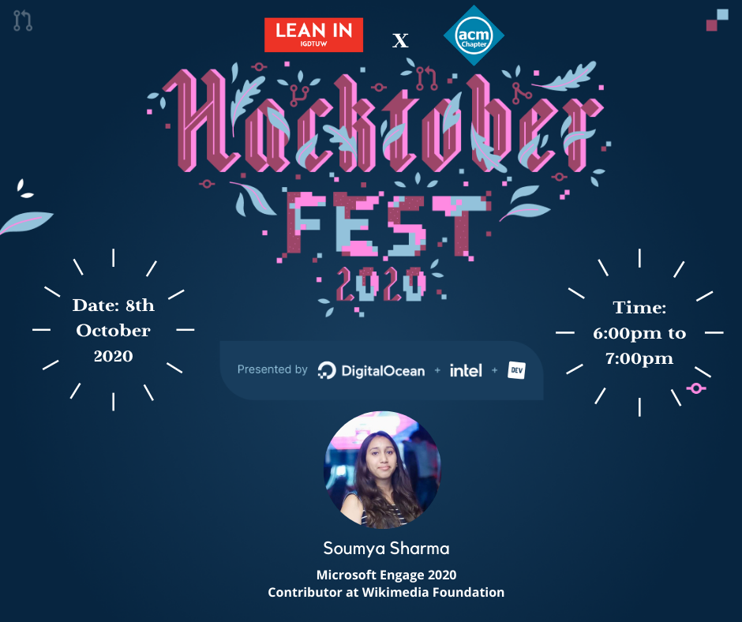

# Hacktoberfest-IGDTUW

[ACM IGDTUW](https://github.com/ACM-IGDTUW), in collaboration with **Lean In @IGDTUW**, brings to you the first session of the OPEN SOURCE SERIES on Introduction to Open Source and Hacktoberfest.

The session will introduce the students to Hacktoberfest, which is an October long fest, encouraging newbies in the domain of Open Source, to get hands-on, make their first pull requests, and earn some cool schwag too. 🤩

The speaker, [Soumya Sharma](https://github.com/soumyaa1804), is a pre-final year student here at IGDTUW. She was a part of Microsoft Engage 2020 and has also contributed to various open-source projects at Wikimedia Foundation.

**Date**: 8th October 2020

**Day**: Thursday

**Time**: 6-7pm

**Register for the event here**: https://organize.mlh.io/participants/events/5384-hacktoberfest-igdtuw

## Schedule

6 - 6:10 pm: Welcome and Poll

6:10 - 6:25 pm: What is Open Source & Hacktoberfest?

6:25 - 6:50 pm: How to contribute to Open Source? (quick workshop)

6:50 - 7:00 pm: Share your work

